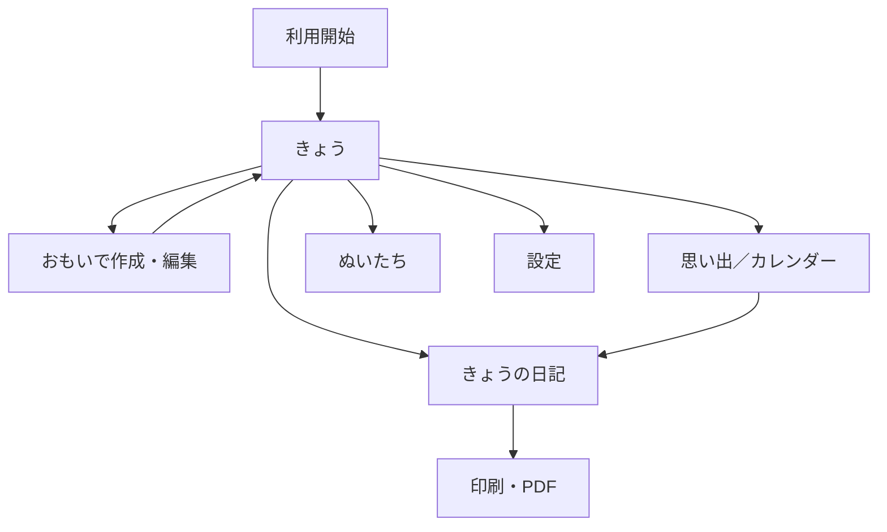

# 04. 画面要件

## 1. 画面一覧

| 画面ID | 画面名                   | 主な役割                                                       |
| ------ | ------------------------ | -------------------------------------------------------------- |
| SC-01  | 利用開始画面             | ローカル利用開始、保存上の注意事項の確認                       |
| SC-02  | きょう画面               | 現在の論理日付の記録確認、おもいで追加、日記導線               |
| SC-03  | おもいで作成・編集画面   | 本文、写真、ぬいぐるみ、日時、場所の編集                       |
| SC-04  | 場所選択画面             | 現在地取得、施設検索、地図上のピン指定                         |
| SC-05  | きょうの日記画面         | 俯瞰地図、時系列のおもいで、1000文字日記の表示・編集           |
| SC-06  | 履歴・カレンダー画面     | 過去日の検索・選択                                             |
| SC-07  | ぬいぐるみ一覧・編集画面 | ぬいぐるみの追加、編集、非表示                                 |
| SC-08  | 設定画面                 | 切り替え時刻、案内時刻、バックアップ、全データ削除             |
| SC-09  | 印刷・書き出し画面       | 印刷範囲、地図掲載有無、PDF保存の設定                          |
| SC-10  | プライバシーポリシー画面 | 取得情報、利用目的、外部サービス、保存・削除、問い合わせの説明 |
| SC-11  | 利用規約画面             | 利用条件、記録データ、禁止事項、停止・削除、責任範囲の説明     |

## 2. 主要ナビゲーション

推奨する主要タブ:

- きょう
- おもいで
- ぬいたち
- せってい

新しいおもいでは、「きょう」画面からアクセスしやすい固定ボタンを提供します。他の主要画面には表示しません。

利用開始後の主要画面では、製品名「ぬいと」を共通ヘッダーに表示します。「きょう」以外では現在の画面名を茶色のH1として表示し、同じ画面名を小見出しとして重複表示しません。

ホーム画面からの起動を含むスマートフォン表示では、アプリ全体を動的viewport内へ収め、共通ヘッダーと下部メニューを固定する。ページ全体ではなく、両者の間にある各画面のコンテンツ領域だけを縦スクロール可能にし、画面切り替え時はコンテンツの先頭を表示する。



## 3. SC-01 利用開始画面

### 表示項目

- おたくま画像を用いた製品アイコン
- アプリ名・短い説明
- 「この端末で始める」ボタン
- ローカル保存の注意事項
- プライバシー方針への導線
- LINEログインと、未登録者が入力するあいことばの領域

### 注意事項

- ブラウザデータ削除、端末故障、端末紛失時にデータを失う可能性を明示する。
- ユーザーが同意してから利用を開始する。
- プライバシーポリシーと利用規約は、利用開始前にも閲覧できる。

## 3.1 SC-10・SC-11 法務情報画面

- `/privacy` と `/terms` の公開URLから直接表示できる。
- 利用開始前と設定画面から開き、アプリへ戻れる。
- 運営者名、問い合わせ先、施行日を環境設定から表示する。
- LINEログインで取得する情報と、取得しない情報を区別して説明する。

## 4. SC-02 きょう画面

### 表示項目

- 現在の論理日付（地図右上の1行の帰属表示より少し下の左側に、日付に沿った幅の1行のコンパクトな丸角カードで表示）
- 当日一緒にいたぬいぐるみの概要
- 全面表示の日別地図
- 写真付き投稿は、白い枠と中央揃えのひし形を持つ64pxの写真ピンを表示し、写真円とひし形を一体とした影を付け、地点を小さい茶色のドットで示す。同行したぬいの小さい円形アイコンは、写真円の上端とアイコン列の中心が重なる位置へ登録順に表示する
- 写真なし投稿は、茶色い外枠を使わず、3pxの白い縁取りと影、同行したぬいぐるみのテーマカラー（複数体はピザの切り分けのような均等な扇形とし、境界だけをなじませる）を内側に使った円形の投稿ピンを表示する
- 場所と時刻がある投稿地点を時系列に結び、地点の接続部でも滑らかに続く曲線の点線
- 下端が常に見え、上下スワイプまたはハンドル操作で開閉できるドロワー内の当日投稿一覧
- ドロワーの角丸とハンドルは固定し、その内側の投稿一覧だけをスクロールする
- 画面右下の「＋」新規投稿ボタン
- 地図上の見開き本アイコン（Material UI `ImportContacts`）による「きょうの日記」ボタン
- ドロワー展開時は「＋」と見開き本アイコンをドロワーに重ならない位置へ移動する
- ドロワー格納時も「＋」と見開き本アイコンを見えているドロワー部分に重ねない
- 地図の帰属表示は右上、拡大縮小操作はドロワーに隠れない地図表示範囲の右側・上下中央に配置する
- 画面全体と新規投稿ボタンはスクロールさせず、ドロワー内の投稿一覧だけをスクロールする
- ドロワー開閉時は地図を維持し、再読込に見えるちらつきを発生させない
- 投稿件数の説明文は表示しない
- 投稿ドロワーの場所付き投稿をタップまたはキーボードで選択すると、現在の縮尺を保ち、ドロワーに隠れた領域を除く表示可能範囲の中央へ対応するピンを移動する
- 地図の写真ピンまたは通常ピンをタップすると、ピンを拡大し、ドロワー展開後の表示可能範囲の中央へ投稿地点を移動してから、ドロワーを開いて該当投稿まで移動する
- 投稿カードは、同行したぬいぐるみ、本文、写真の順に表示し、同行したぬいの下側、本文・写真の上下、末尾情報の上側へカード内側余白の半分に相当する余白を設ける。末尾の左側に補助情報として控えめな時刻とMUIのピンアイコンを伴う場所名、右側に鉛筆アイコンの編集ボタンを配置し、編集ボタンの44pxタップ領域によって末尾領域の行高を広げない

場所付き投稿がない場合は、位置情報権限が許可済みなら現在地付近を初期表示する。未許可の場合は位置情報を自動要求せず、既定範囲を表示する。

### 日記ボタンの状態

| 条件                   | 表示例                                               | 強調               |
| ---------------------- | ---------------------------------------------------- | ------------------ |
| 案内時刻前・未作成     | 見開き本アイコン（読み上げ: きょうの日記を見る）           | 通常               |
| 案内時刻以降・未作成   | 見開き本アイコン（読み上げ: きょうの日記を書く）           | 強調               |
| 作成済み               | 見開き本アイコン（読み上げ: きょうの日記を見る・編集する） | 通常または完了状態 |
| 作成済みで投稿更新あり | 見開き本アイコン（読み上げ: きょうの日記を見る・編集する） | 注意表示可         |

### 日付表示

- 表示する「きょう」は暦日ではなく、現在設定されている一日の切り替え時刻に基づく論理日付とする。
- 必要に応じて、深夜帯には「この記録は9月15日分です」のような補足を表示する。

## 5. SC-03 おもいで作成・編集画面

### 入力項目

- 写真0〜4枚（最上段。Material UIの`AddAPhoto`アイコンを伴う「写真を追加」と、カメラアイコンを伴う「カメラを起動」を分けて表示し、ファイル名は表示しない）
- 一緒にいたぬいぐるみ0体以上（円形アイコンとアイコン下の名前バッジを表示し、選択時はアイコン上にチェックマークを重ねる）
- ひとこと本文0〜300文字
- 行動日
- 行動時刻（初期選択の「現在時刻」、「時刻を手動設定する」、「時刻を設定しない」の3択。項目の見出しは太字で表示し、選択肢に応じた日時・日付・説明は当該選択肢の直下へ字下げして表示する）
- 場所（任意。「場所を記録する」「場所を記録しない」のラジオボタンを表示し、初期選択は「場所を記録する」とする。場所指定の説明、地図、場所名入力は「場所を記録する」の選択中だけ当該選択肢の直下へ字下げした設定領域として表示し、説明と地図の間隔を詰める。入力ラベルは「場所」、ピンを初めて配置した際の既定値は「ここで遊んだよ」とし、ラベルと入力値は通常の太さで表示する）

### 操作

- 写真撮影（対応するスマートフォンでは「カメラを起動」から背面カメラを直接起動し、非対応環境ではブラウザ標準の画像選択へフォールバックする）
- 写真ライブラリから選択
- 写真削除（各写真右上のMaterial UI `HighlightOff`アイコン）
- 写真並び替え（ドラッグ、左右スワイプ、または前後移動ボタン。並び順の1枚目を代表写真とする）
- 1枚目の写真を使う円形写真ピンの表示範囲・拡大率調整（未調整時は縦横比から短辺を円へ合わせて余白なく中央表示する。1枚目左下の鉛筆アイコン。操作名は「ピンに表示する画像を調整」とし、利用者向け文言には「写真ピン」を使わない）
- ぬいぐるみ複数選択
- 位置情報権限が許可済みの場合、現在地を場所の初期値として表示
- 現在地付近への地図移動
- 地図のタップまたはピンのドラッグによる場所指定（選択中のピンはスマートフォンでも視認できる専用表示とする）
- 「場所を記録しない」の選択による場所情報の解除
- 保存
- 編集時の削除
- NFCタグ用リンクから開いた場合、既存の下書きを復元して対応するぬいを追加選択

### バリデーション

- 300文字超過時は保存不可。
- 5枚目の写真は追加不可。
- 「時間不明」を選ぶ場合、論理日付の選択を必須とする。
- 何も入力されていない空投稿は保存不可とする。本文、写真、場所のいずれかを必要とする。

## 6. SC-04 場所選択画面

### 提供方法

少なくとも次のいずれかを提供します。

- 施設・住所検索
- 地図上のピン指定

地図上のピンはドラッグで位置を微調整できます。Shouldとして、現在地付近へ地図を移動してからピンを指定できる操作を加えます。

新規投稿時に位置情報権限がすでに許可されている場合は、現在地を初期場所として地図へ表示します。未許可の場合は自動で権限を要求せず、地図上の現在地ボタンを選択したときに要求します。

### 状態

- 位置情報許可前
- 許可済み
- 拒否済み
- 現在地取得中
- 取得失敗
- オフライン
- 検索結果なし

拒否または失敗しても、投稿画面へ戻り場所なしで保存できるようにします。

## 7. SC-05 きょうの日記画面

地図または地図の空状態を画面上部へ大きく配置し、地図上にはカードを重ねない。その下のおもいで投稿領域の先頭に、曜日付きの「○年○月○日（○）の日記」と、その日に登場するぬいの円形アイコンおよび「とおでかけ」を、上余白9pxかつ小さめの文字によるコンパクトなヘッダーとして表示する。投稿と一日のまとめは角丸カードで表示する。日記保存後に投稿が変更された場合も、更新通知文は表示しない。

共通ヘッダー、上部地図、日記の投稿一覧ヘッダーは画面内に固定し、投稿一覧ヘッダーより下のおもいで投稿領域と一日のまとめだけを縦スクロール可能にする。

遷移元によらず、投稿領域の曜日付き「○年○月○日（○）の日記」をH1にする。戻るボタンは置かず、下部メニューを表示したまま遷移元の項目を選択状態にする。

### 表示順

1. 一日の行動記録を俯瞰する地図
2. 曜日付き日付の日記見出し
3. 当日登場したぬいぐるみのアイコンと「とおでかけ」
4. 時刻あり投稿の時系列一覧
5. 時刻不明投稿一覧
6. 一日のまとめ入力欄
7. 保存状態・最終更新日時
8. 印刷・PDF導線

### 概略レイアウト

```text
┌──────────────────────────┐
│                                  │
│          一日の俯瞰地図             │
│      ● …… ● …… ●     ○          │
│                         時間不明    │
│                                  │
├──────────────────────────┤
│ 2026年9月15日（火）の日記           │
│ [くま吉][モコ] とおでかけ            │
├──────────────────────────┤
│ 09:30                             │
│ [ 写真 ]                          │
│ くま吉とカフェで朝ごはん             │
│ ○○カフェ                          │
├──────────────────────────┤
│ 12:10                             │
│ [ 写真 ][ 写真 ]                   │
│ 公園でたくさん写真を撮った            │
│ ○○公園                            │
├──────────────────────────┤
│ 時間不明                            │
│ [ 写真 ]                          │
│ お土産屋さんにも立ち寄った            │
├──────────────────────────┤
│ きょうの日記                         │
│ ┌──────────────────────┐ │
│ │ 一日のまとめを入力……             │ │
│ └──────────────────────┘ │
│                         324 / 1000 │
└──────────────────────────┘
```

### 地図状態

| 状態             | 表示                                           |
| ---------------- | ---------------------------------------------- |
| 場所付き投稿なし | 地図を非表示、または「場所の記録はありません」 |
| 1地点            | 地点を中央に適切な縮尺で表示                   |
| 複数地点         | 全地点が見える範囲へ自動調整                   |
| 時刻不明地点あり | ピンのみ表示し、足あと線から除外               |
| 地図読込失敗     | 投稿一覧と日記欄は利用可能にする               |

### 投稿一覧

- 時刻あり投稿を行動日時昇順で表示する。
- 時刻不明投稿を末尾へまとめ、投稿日時昇順で表示する。
- 時刻不明投稿には「時間不明」と表示する。
- 投稿日時は補助情報として表示してよいが、行動時刻として扱わない。
- 投稿写真をタップまたはkeyboardで選択すると、保存画像を本来の縦横比で拡大表示する。
- 拡大表示は閉じるボタン、背景のタップ、またはEscapeキーで閉じられるようにする。

### 一日のまとめ

- 入力欄の見出しは上側へ適度な余白を設けた「きょうのにっき」とし、「一日のまとめ」「きょうの気持ちを残す」は画面上に重複表示しない。
- 保存済みの場合は本文を閲覧表示し、文字を伴わない鉛筆アイコンの編集ボタンを選択したときだけ入力欄と保存操作を表示する。編集ボタンの読み上げ名は「きょうのにっきを編集」とする。
- 最大1000文字。
- 改行可能。
- 文字数表示。
- 投稿0件でも入力可能。
- 自動保存または未保存警告を提供する。

## 8. SC-06 履歴・カレンダー画面

### 表示項目

- 月単位のカレンダーまたは日付一覧
- 投稿ありの日
- 一日のまとめありの日
- 各日付に登場したぬいぐるみのアイコン（投稿件数の左に重複なく表示）

### 操作

- 日付選択で該当日の「日付の日記」を開く。
- 前月・翌月移動。
- Shouldとして、ぬいぐるみ名・場所名の簡易検索を提供する。

## 9. SC-07 ぬいぐるみ一覧・編集画面

### 一覧

- テーマカラーの囲み線を反映したアイコン
- アイコン画像が未設定の場合は、ぬいぐるみ名の先頭文字を表示する円形の代替アイコン
- 名前
- 非表示状態
- 編集導線
- 新規登録ボタン

### 編集

- 名前、テーマカラー、アイコン画像の順で表示する
- 名前、テーマカラー、アイコン画像の項目見出しを同じ開始位置へ揃える
- テーマカラー（「設定する」「設定しない」のラジオボタン。初期値は「設定しない」で、「設定する」を選ぶとその直下にカラーピッカーを表示する）
- アイコン画像（投稿写真と同じMUIの写真追加アイコン付き選択操作）
- アイコン画像選択の直下に、円形アイコンとして表示される範囲のプレビューを表示する。小さい一覧サイズに関する説明文と調整確定ボタンは表示せず、ぬいの保存時に表示中の位置と拡大率を保存する
- ドラッグによるアイコン画像の位置調整
- ピンチによる拡大率の調整
- keyboardや細かな補正に使える横位置、縦位置、拡大率のスライダー
- 画像の選び直しと削除
- 非表示設定（Should）
- 登録済みのぬいを削除するボタンと、過去のおもいでは残して関連だけを外す旨の確認
- 保存済みのぬいだけに表示する「NFCタグ（ベータ）」設定
- NFCタグ用リンクの発行、選択コピー、再発行
- Web NFC対応環境だけに表示する「NFCタグに書き込む」操作
- Web NFC非対応環境では、コピーしたURLを外部のNFCタグ書き込みアプリで設定する案内

円形プレビューは保存前と保存後の表示を一致させます。位置と拡大率は表示用設定として保存し、元画像を円形や正方形へ破壊的に切り抜きません。

一時的に使わない場合は非表示を利用します。削除を選んだ場合も過去のおもいで自体は残し、対象のぬいとの関連だけを外します。

## 10. SC-08 設定画面

### 必須設定

- 時刻設定領域のH2見出し「一日の切り替わり」
- 一日の切り替え時刻（初期値00:00）
- 日記案内時刻（初期値21:00）
- 写真ピンに一緒にいたぬいを表示するかの設定（初期値は表示する）
- 認証状態に応じた保存先の説明（確認中、LINEログイン中のサーバー＋ブラウザ保存、未ログインのブラウザ内保存、確認失敗を区別する）
- 全データ削除（LINEログイン中はクラウドデータとアカウント連携も対象）

### 推奨設定

- バックアップ書き出し
- バックアップ復元
- ストレージ使用量
- PWAホーム画面追加案内

### 切り替え時刻変更確認

保存前に次を表示します。

- 時刻あり投稿の所属日が変わる可能性
- 地図・足あと線・一覧が再構成されること
- 時刻不明投稿の日付は変わらないこと
- 一日のまとめ本文は元の日付に残ること

## 11. SC-09 印刷・書き出し画面

Should要件として次を提供します。

- 対象日
- 地図を含める／含めない
- 写真・投稿・一日のまとめのプレビュー
- ブラウザ印刷
- PDF保存

地図のSNS直接共有は提供しません。

## 12. 共通状態

| 状態       | 要件                                                     |
| ---------- | -------------------------------------------------------- |
| 読み込み中 | スピナー、スケルトン等で進行状態を示す                   |
| 保存中     | 二重送信を防止し、保存中であることを示す                 |
| 保存完了   | 完了状態を短く通知する                                   |
| 保存失敗   | 原因と再試行方法を示し、入力内容を可能な範囲で保持する   |
| オフライン | 保存済みデータは利用可能にし、地図・検索の制限を表示する |
| 容量不足   | 既存データを破損させず、バックアップや整理を案内する     |
| 権限拒否   | 権限なしでも使える代替操作を提示する                     |

## 13. 共通タイポグラフィ

- 日本語表示は、端末で利用可能な丸みのあるゴシック体を優先し、利用できない場合は端末標準のゴシック体を使用する。
- 本文とフォーム入力は16px相当を基準とし、補足文字も判読可能な大きさを維持する。
- 見出しだけ異質な書体へ切り替えず、同系統の書体の大きさと太さで情報の階層を示す。
- iPhone Safariで入力欄へフォーカスした際に意図しない自動拡大が起きにくい文字サイズとする。
